# Feats: The Path Board

**What steps do you take to advance yourself?**

Feats represent your journey of personal growth—not raw power, but **focus and flavor**. They augment your abilities without overshadowing your class. Each node offers a different lens through which to experience the world: combat tactics, social maneuvering, skilled precision, or resourceful adaptation.

## IMPORTANT: Paths vs Ways

**This document covers PATHS—the general feat system available to all classes.**

**Do NOT confuse this with WAYS:**
- **Paths** (this document) = General feats gained at Levels 1, 3, 6, 9, 10. Universal to all classes. Allows cross-class builds.
- **Ways** (see Classes document) = Class-specific subclass specializations gained every level (1-10). Deepens your chosen class fantasy.

**You advance BOTH systems simultaneously as you level.**

---

## The Cosmological Truth of the Path Board

**The Path Board is not arbitrary.**

It is the **mechanical representation of the Custodial Powers converging in the Mortal Weave**—where cosmic philosophies overlap, balance, and create mortal potential.

The Mortal Weave is the only realm where these forces meet as equals. The Path Board reflects that convergence.

---

### Why This Matters: The Crown-Breaking's Gift

When Azravael broke the Crown and proved cosmic law could be rewritten, the cosmos responded by crystallizing the Custodial Powers into enforceable authorities across all planes. But in the Mortal Weave—where no single power dominates—something unique emerged.

**Mortals became the living intersection of cosmic principles.**

The Path Board is not just character advancement. It is the map of powers that exist because one deity's treachery forced the cosmos to create *limits that even gods must acknowledge*. When you walk these paths, you are walking channels carved by the cosmos's response to Azravael's wound.

The angels of the Empyreal Accord can walk one Charge of the Concordant Halls. The enforcers of Bael-Zaroth can walk another. The druids of the Wild Expanse serve certain Domains of the Living Accord while the death-priests of the Gloam serve others.

**Only mortals can walk them all. Only mortals can hold contradictions that would shatter gods.**

That power is what turns adventurers into legends.

---

### The Four Pillars of Mortal Growth

The Path Board is organized around the cosmic forces that stabilize the Mortal Weave:

#### 🗡️ The Concordant Halls — Oath and Purpose
*"Commitment shapes reality. Purpose gives it direction."*

**Philosophy:** Sworn dedication, martial discipline, protection of others, honoring bonds.

The Shield exists in the Empyreal Accord guarding celestial gates. The Shield exists in the Engine of Bael-Zaroth protecting contract-holders from breach. The Shield exists in the Gloam where death-knights guard tombs. **None of these are "good" or "evil"—they are committed.**

**Path Disciplines:**
- **Martial Focus** (War-Trained, Weapon Specialist, Defensive Stance)
- **Protective Commitment** (Anchor Point, Hearth-Keeper, Steadfast)
- **Oath-Bound Leadership** (Tactical Mind, Battle Commander, Rally Point)

**Bridge Connections:** Where Oath meets Life (Guardian protects nature), where Purpose meets Knowledge (Tactical analysis), where Commitment meets Self (Disciplined independence)

---

#### 🌿 The Living Accord — Life and Death
*"Life continues because death is allowed to finish its work."*

**Philosophy:** Cycles, survival, natural law, necessary endings, primal adaptation.

The Tidekeepers of the Mortal Weave and the Rot-shepherds of the Gloam both serve the Living Accord. The druids who nurture forests and the predators who cull them both answer to the same cosmic principle. Growth without Rot is cancer. Rot without Growth is true death.

**Path Disciplines:**
- **Wilderness Mastery** (Nature's Treaty, Primal Instinct, Tracker's Eye)
- **Survival Imperative** (Endurance Training, Forager, Hardy Constitution)
- **Cycle Understanding** (Death's Witness, Renewal Focus, Balance Keeper)

**Bridge Connections:** Where Life meets Knowledge (Understanding ecosystems), where Survival meets Oath (Protecting the pack), where Nature meets Self (Self-reliance in wild)

---

#### 📚 The Curator Arcanum — Knowledge and Humility
*"Wisdom is knowing what should remain unknown."*

**Philosophy:** Learning, careful study, restraint through understanding, preserving truth.

The Curator Arcanum exists because Velkir the Ash-Tongued proves what happens when knowledge loses humility. They war with him philosophically—not by destroying truths, but by preserving the *context* that makes truth safe. The scholar who studies forbidden lore and the sage who seals it both serve the same principle: knowledge-with-limits.

**Path Disciplines:**
- **Scholarly Pursuit** (Loremaster, Research Focus, Historical Insight)
- **Arcane Study** (Spell Scholar, Ritual Knowledge, Magical Theory)
- **Humble Wisdom** (Know Your Limits, Cautious Curiosity, Truth-Seeker)

**Bridge Connections:** Where Knowledge meets Oath (Teaching as service), where Wisdom meets Life (Understanding cycles), where Study meets Self (Self-education mastery)

---

#### 👤 The Sovereign Self — Independence and Mastery
*"You are not what you were. You are choosing."*

**Philosophy:** Self-determination, resource autonomy, internal economy, refusing external dependency.

The Sovereign Self is the mortal addition to the cosmic equation. The gods embody absolutes. The Custodial Powers serve Balance. But *mortals?* Mortals can refuse both. The wanderer who answers to no oath, the self-made master who forges their own path—these are not *opposed* to the other Pillars. They are the proof that mortal will can stand alongside cosmic principles without being consumed.

**Path Disciplines:**
- **Travel Mastery** (Wanderer, Tireless Traveler, Cartographer, Cultural Adapter)
- **Internal Mastery** (Self-Made, Iron Focus, Efficient Action, Self-Reliant, Unbroken)
- **Freedom Through Skill** (Resourceful, Jack of All Trades, Versatile Fighter)

**Bridge Connections:** Where Self meets Oath (Self-imposed discipline), where Independence meets Life (Surviving alone), where Mastery meets Knowledge (Self-taught expertise)

---

### The Convergence Points (Bridge Nodes)

**The most powerful feats exist where philosophies overlap.**

These are marked with → and connect multiple Pillars:

**War-Trained → Silver Tongue** (Oath + Knowledge)
- Combat expertise grants social leverage through respect/fear

**Nature's Treaty → Hearth-Keeper** (Life + Oath) 
- Protecting wild places and protecting communities share roots

**Research Focus → Tool Proficiency** (Knowledge + Self)
- Study leads to self-directed craftsmanship

**Shadow Step → Quick Draw** (Self + Oath)
- Personal agility serves tactical commitment

These convergence points reward players who **walk between philosophies** rather than specializing in one exclusively.

---

## Visual Map: The Path Board

Below is a visual representation of the Path Board showing all Primary Feats (Level 1 choices) and their major connections across the Four Pillars:

```mermaid
graph TB
    %% Define the Four Pillars as containers
    subgraph CH["🗡️ CONCORDANT HALLS<br/>Oath & Purpose"]
        WT[War-Trained<br/>MARTIAL PRIMARY]
        HK[Hearth-Keeper<br/>HEARTH PRIMARY]
        
        WT --> WS[Weapon Specialist]
        WT --> DS[Defensive Stance]
        WT --> CR[Combat Reflexes]
        WT --> TM[Tactical Mind]
        
        WS --> VF[Versatile Fighter]
        DS --> AP[Anchor Point]
        CR --> QD[Quick Draw]
        TM --> BC[Battle Commander]
        
        AP --> HTL[Hold the Line]
        
        HK --> FM[Field Medic]
        HK --> CW[Calming Words]
        HK --> PI[Protective Instinct]
        HK --> HT[Healer's Touch]
        
        FM --> CM[Combat Medic]
        CW --> VC[Voice of Comfort]
        PI --> GC[Guardian's Call]
        HT --> RP[Restorative Presence]
    end
    
    subgraph LA["🌿 LIVING ACCORD<br/>Life & Death"]
        WildT[Wild-Touched<br/>PRIMAL PRIMARY]
        ShT[Shadow-Trained<br/>SHADOW PRIMARY]
        
        WildT --> BB[Beast Bond]
        WildT --> TE[Tracker's Eye]
        WildT --> NR[Natural Resilience]
        WildT --> Forage[Forager]
        
        BB --> PT[Pack Tactics]
        TE --> PF[Pathfinder]
        NR --> SI[Survivor's Instinct]
        Forage --> Herb[Herbalist]
        
        ShT --> SS[Shadow Step]
        ShT --> AmP[Ambush Predator]
        ShT --> SM[Silent Movement]
        ShT --> Mis[Misdirection]
        
        SS --> BS[Blink Step]
        AmP --> PH[Patient Hunter]
        SM --> GW[Ghost Walk]
        Mis --> Feint
        Mis --> SoH[Sleight of Hand]
    end
    
    subgraph CA["📚 CURATOR ARCANUM<br/>Knowledge & Humility"]
        SchM[Scholar's Method<br/>SCHOLAR PRIMARY]
        SpT[Spell-Touched<br/>ARCANE PRIMARY]
        
        SchM --> LM[Lore Master]
        SchM --> Craft[Craftsman]
        SchM --> Ling[Linguist]
        SchM --> Inv[Investigator]
        
        LM --> AL[Arcane Lore]
        Craft --> MA[Master Artisan]
        Ling --> Poly[Polyglot]
        Inv --> Det[Detective]
        
        SpT --> RE[Ritual Expertise]
        SpT --> SF[Spell Flexibility]
        SpT --> MD[Metamagic Dabbling]
        SpT --> AE[Arcane Efficiency]
        
        RE --> CDS[Cross-Domain Study]
        SF --> AC[Adaptive Caster]
        MD --> ME[Metamagic Expansion]
        AE --> ER[Efficient Rituals]
    end
    
    subgraph SS_PILLAR["👤 SOVEREIGN SELF<br/>Independence & Mastery"]
        Wand[Wanderer<br/>TRAVEL PRIMARY]
        SelfM[Self-Made<br/>SOVEREIGN PRIMARY]
        
        Wand --> TT[Tireless Traveler]
        Wand --> Carto[Cartographer]
        Wand --> CultA[Cultural Adapter]
        Wand --> Res[Resourceful]
        
        TT --> TB[Trail Blazer]
        Carto --> MR[Map Reader]
        CultA --> WW[World Wise]
        Res --> JAT[Jack of All Trades]
        
        SelfM --> IronF[Iron Focus]
        SelfM --> EffA[Efficient Action]
        SelfM --> SelfR[Self-Reliant]
        SelfM --> Unbrok[Unbroken]
        
        IronF --> LaserF[Laser Focus]
        EffA --> Conserv[Conservation]
        SelfR --> LoneW[Lone Wolf]
        Unbrok --> Temp[Tempered]
    end
    
    subgraph CROSS["⚖️ CONVERGENCE<br/>Multiple Philosophies"]
        Unyield[Unyielding<br/>RESILIENCE PRIMARY]
        VirtB[Virtue-Bound<br/>COSMIC PRIMARY]
        PactB[Pact-Bound<br/>PACT PRIMARY]
        LimB[Liminal-Born<br/>LIMINAL PRIMARY]
        SilT[Silver Tongue<br/>SOCIAL PRIMARY]
        
        Unyield --> SW[Second Wind]
        Unyield --> FW[Fortified Will]
        Unyield --> PTol[Pain Tolerance]
        Unyield --> Stub[Stubborn]
        
        SW --> DR[Deep Reserves]
        FW --> Unshake[Unshakeable]
        Stub --> IO[Immovable Object]
        
        VirtB --> AS[Affinity Surge]
        VirtB --> CosmA[Cosmic Awareness]
        VirtB --> VV[Virtue's Voice]
        VirtB --> ResS[Resonant Strike]
        
        AS --> CosmR[Cosmic Reservoir]
        CosmA --> FW_fate[Fate's Whisper]
        VV --> IP[Inspiring Presence]
        ResS --> CC[Cosmic Conduit]
        
        PactB --> PatW[Patron's Whisper]
        PactB --> BorP[Borrowed Power]
        PactB --> MbD[Marked by Darkness]
        PactB --> InfR[Infernal Resilience]
        
        PatW --> DarkC[Dark Counsel]
        MbD --> AoD[Aura of Dread]
        
        LimB --> SpiS[Spirit Sense]
        LimB --> PhStep[Phase Step]
        LimB --> BetW[Between Worlds]
        LimB --> PlanA[Planar Awareness]
        
        SpiS --> SpiG[Spirit Guide]
        PhStep --> BlinkT[Blink Travel]
        BetW --> IncD[Incorporeal Defense]
        PlanA --> ThW[Threshold Walker]
        
        SilT --> Charm[Charming]
        SilT --> Decep[Deceptive]
        SilT --> ComP[Commanding Presence]
        SilT --> Neg[Negotiator]
        
        Charm --> Belov[Beloved]
        Decep --> MoD[Master of Disguise]
        ComP --> NatL[Natural Leader]
        Neg --> Med[Mediator]
    end
    
    %% BRIDGE CONNECTIONS (Cross-Pillar)
    %% Martial ↔ Shadow
    QD -.->|Bridge| AmP
    CR -.->|Bridge| SS
    
    %% Martial ↔ Hearth
    DS -.->|Bridge| HTL
    PI -.->|Bridge| GC
    
    %% Martial ↔ Social
    TM -.->|Bridge| BC
    ComP -.->|Bridge| NatL
    
    %% Martial ↔ Scholar
    VF -.->|Bridge| JAT
    
    %% Shadow ↔ Primal
    AmP -.->|Bridge| PH
    GW -.->|Bridge| TE
    
    %% Shadow ↔ Social
    Mis -.->|Bridge| Decep
    
    %% Shadow ↔ Liminal
    SS -.->|Bridge| PhStep
    GW -.->|Bridge| BetW
    
    %% Primal ↔ Scholar
    Forage -.->|Bridge| Herb
    TE -.->|Bridge| Inv
    
    %% Primal ↔ Hearth
    Herb -.->|Bridge| FM
    NR -.->|Bridge| SI
    
    %% Scholar ↔ Social
    Neg -.->|Bridge| Med
    Ling -.->|Bridge| Poly
    
    %% Scholar ↔ Arcane
    RE -.->|Bridge| CDS
    AE -.->|Bridge| ER
    
    %% Scholar ↔ Wanderer
    Carto -.->|Bridge| MR
    Res -.->|Bridge| JAT
    
    %% Wanderer ↔ Primal
    TT -.->|Bridge| TB
    
    %% Wanderer ↔ Liminal
    PlanA -.->|Bridge| ThW
    
    %% Cosmic ↔ Social
    VV -.->|Bridge| IP
    
    %% Cosmic ↔ Scholar
    CosmA -.->|Bridge| FW_fate
    
    %% Cosmic ↔ Arcane
    AS -.->|Bridge| CosmR
    ResS -.->|Bridge| CC
    
    %% Resilience ↔ Martial
    Stub -.->|Bridge| IO
    
    %% Resilience ↔ Hearth
    SW -.->|Bridge| DR
    
    %% Resilience ↔ Cosmic
    FW -.->|Bridge| Unshake
    
    %% Pact ↔ Shadow
    MbD -.->|Bridge| AoD
    
    %% Pact ↔ Resilience
    InfR -.->|Bridge| Unyield
    
    %% Pact ↔ Liminal
    SpiS -.->|Bridge| SpiG
    
    %% Hearth ↔ Social
    CW -.->|Bridge| VC
    
    %% Liminal ↔ Social
    Charm -.->|Bridge| Belov
    
    %% Sovereign ↔ Martial
    IronF -.->|Bridge| TM
    LaserF -.->|Bridge| WT
    
    %% Sovereign ↔ Shadow
    SelfR -.->|Bridge| ShT
    LoneW -.->|Bridge| GW
    
    %% Sovereign ↔ Resilience
    Unbrok -.->|Bridge| Unyield
    Temp -.->|Bridge| PTol
    
    %% Sovereign ↔ Cosmic
    Unbrok -.->|Bridge| VirtB
    
    %% Sovereign ↔ Scholar
    EffA -.->|Bridge| Craft
    Conserv -.->|Bridge| SchM
    
    %% Sovereign ↔ Arcane
    Conserv -.->|Bridge| SpT
    
    %% Sovereign ↔ Wanderer
    SelfR -.->|Bridge| Wand
    LoneW -.->|Bridge| Wand
    
    %% Styling
    classDef primary fill:#FFD700,stroke:#FF8C00,stroke-width:4px,color:#000
    classDef oath fill:#DC143C,stroke:#8B0000,stroke-width:2px,color:#FFF
    classDef life fill:#228B22,stroke:#006400,stroke-width:2px,color:#FFF
    classDef knowledge fill:#4169E1,stroke:#00008B,stroke-width:2px,color:#FFF
    classDef sovereign fill:#9370DB,stroke:#4B0082,stroke-width:2px,color:#FFF
    classDef convergence fill:#FF69B4,stroke:#C71585,stroke-width:2px,color:#FFF
    
    class WT,HK,WildT,ShT,SchM,SpT,Wand,SelfM,Unyield,VirtB,PactB,LimB,SilT primary
    class WS,DS,CR,TM,FM,CW,PI,HT,AP,HTL,CM,VC,GC,RP oath
    class BB,TE,NR,Forage,SS,AmP,SM,Mis,PT,PF,SI,Herb,BS,PH,GW,Feint,SoH life
    class LM,Craft,Ling,Inv,RE,SF,MD,AE,AL,MA,Poly,Det,CDS,AC,ME,ER knowledge
    class TT,Carto,CultA,Res,TB,MR,WW,JAT,IronF,EffA,SelfR,Unbrok,LaserF,Conserv,LoneW,Temp sovereign
    class SW,FW,PTol,Stub,AS,CosmA,VV,ResS,PatW,BorP,MbD,InfR,SpiS,PhStep,BetW,PlanA,Charm,Decep,ComP,Neg,DR,Unshake,IO,CosmR,FW_fate,IP,CC,DarkC,AoD,SpiG,BlinkT,IncD,ThW,Belov,MoD,NatL,Med convergence
```

**Legend:**
- 🟡 **Gold Nodes** = 13 Primary Feats (your Level 1 cosmic anchor)
- **Solid Arrows** = Direct progression within a discipline
- **Dotted "Bridge" Lines** = Convergence points where philosophies overlap
- 🔴 **Red Nodes** = Concordant Halls paths (Oath & Purpose)
- 🟢 **Green Nodes** = Living Accord paths (Life & Death)
- 🔵 **Blue Nodes** = Curator Arcanum paths (Knowledge & Humility)
- 🟣 **Purple Nodes** = Sovereign Self paths (Independence & Mastery)
- 🩷 **Pink Nodes** = Convergence paths (multiple philosophies)

**Example Journeys Visible in the Map:**
- **Warrior-Scholar**: War-Trained → Versatile Fighter → (bridge) → Jack of All Trades → Scholar's Method
- **Shadow-Healer**: Hearth-Keeper → (convergence nodes) → Shadow-Trained → Silent Movement
- **Cosmic Wanderer**: Wanderer → Planar Awareness → (bridge) → Liminal-Born → Threshold Walker
- **Battle-Diplomat**: War-Trained → Tactical Mind → Battle Commander → (bridge) → Silver Tongue

---

## How the Path Board Works

**Level 1:** Choose one **Primary Feat** (your foundation—the strongest feat you'll ever take)
- This anchors you to one of the Four Pillars or a Convergence Point
- Your character begins their journey aligned with one cosmic philosophy

**Levels 3, 6, 9, 10:** Select one **Connected Node** adjacent to any feat you already possess (including diagonal connections)
- You may deepen your alignment with one Pillar (specialization)
- OR you may branch toward Convergence Points (versatility)
- Your final Path web will reflect which cosmic forces guide your growth

### Path Board Rules

- **Start with Foundation:** At Level 1, choose one Primary Feat from the disciplines below. This is your cosmic anchor.
- **All Nodes Equal Power:** Nodes beyond your Primary are roughly equal in power regardless of when you take them—no power creep by level
- **Follow Adjacent Paths:** Each new feat must connect to one you already have (adjacent/diagonal)—you are walking toward convergence, not teleporting
- **Build Your Web:** You can branch into multiple Pillars or specialize deeply in one. Both approaches are valid.
- **Cross-Pillar Connections:** Bridge nodes (marked with →) connect multiple philosophies and reward hybrid builds
- **Diverse Benefits:** Each Pillar offers combat, social, skill, downtime, and resource utilities—not just "more of what your class does"
- **Node Format:** Each feat shows its connections: `[Connected Node Names]`

### Design Philosophy

**The Path Board reflects mortal choice in a cosmos of absolutes.**

Gods embody single truths. Custodial Powers maintain balance between paired tensions.

**Mortals walk the paths between them.**

#### Universal Access — NO Class Restrictions

**CRITICAL: Any class can walk any path.**

The Four Pillars are **cosmic philosophies**, not class identities:
- A **Priest** can take War-Trained (Concordant Halls) and become a warrior-cleric
- A **Combatant** can take Loremaster (Curator Arcanum) and become a scholar-knight
- A **Weaver** can take Nature's Treaty (Living Accord) and become a wilderness mage
- A **Ranger** can take Silver Tongue (Concordant Halls + Curator) and become a diplomat-scout
- A **Shaman** can take Defensive Stance (Concordant Halls) and become a shield-bearer for spirits

**Your class determines what you ARE. Your Paths determine which cosmic philosophies you WALK.**

The Concordant Halls does not belong to Combatants.  
The Living Accord does not belong to Rangers.  
The Curator Arcanum does not belong to Weavers.  
The Sovereign Self does not belong to rogues.

**These Powers converge in the Mortal Weave for ALL mortals, equally.**

#### Paths Do NOT Alter Class Abilities

**Paths augment your character, not your class:**

- War-Trained does NOT make you cast spells better (if you're a Weaver)
- Loremaster does NOT make you better at martial combat (if you're a Combatant)
- Nature's Treaty does NOT grant class features (if you're a Priest)

**Paths are PARALLEL growth:**
- Your **class abilities** define your mechanical toolkit (spellcasting, combat techniques, divine power)
- Your **Paths** define your focus areas (tactical mind, social expertise, survival skills, arcane study)

A Priest with War-Trained is still primarily a divine caster—they just ALSO have martial training.  
A Combatant with Silver Tongue is still primarily a warrior—they just ALSO have diplomatic skill.

**This allows cross-class fantasy without multiclassing:**
- The scholar-knight who studies between battles
- The warrior-priest who defends with blade AND prayer
- The wilderness mage who knows both spell and survival
- The diplomatic combatant who wins wars through words first, steel second

#### The Question Your Path Answers

**"Which cosmic forces guide my growth?"**

- A Priest starting in **Concordant Halls** → Oath and duty shape their divine service
- A Priest starting in **Curator Arcanum** → Knowledge and humility shape their divine service
- A Combatant starting in **Living Accord** → Life and death shape their warrior's path
- A Weaver starting in **Sovereign Self** → Independence and mastery shape their arcane journey

Your Path web (by Level 10) will show which philosophies matter most to YOU—regardless of what your class is.

### Feat Power Budget

**Each feat node grants ONE of the following:**
- **+1 die in a specific narrow circumstance** ("when defending an ally," "when using signature weapon against surprised foe")
- **Reduce required successes by 1 in a specific narrow circumstance** ("social checks to comfort grieving," "tracking in wilderness")
- **Once per scene ability** (triggered situational effect with narrow scope)
- **Minor HD recovery trigger** ("regain 1 HD when you prevent ally death," "restore 1 HD when oath is honored")
- **Social leverage trigger** ("gain reputation benefit in specific context")
- **Tactical positioning benefit** ("move without triggering reactions in specific case")

**Feats NEVER grant:**
- ❌ Permanent +1 defense die to all defense rolls
- ❌ Permanent +1 proficiency
- ❌ Increased exertion cap per turn
- ❌ Scaling HD pool increases (flat one-time bonuses on specific Primaries are acceptable)
- ❌ Flat damage increases
- ❌ Always-on bonuses that bypass risk

**Primary Feat Exception — Proficiency Milestones:**
Primary Feats are the strongest feats you'll ever take. Each Primary includes a **Proficiency 3+ Milestone** — a modest enhancement that activates at Proficiency 3 (Levels 5-6). This ensures Primaries grow with your character without dominating high-level play. Milestones are tied to Proficiency because it's the system's cleanest scaling stat.

**Critical Principle: Feats change WHEN you push, not HOW STRONG pushing is.**

Your system has:
- Exertion risk (1s burn HD)
- Resolve collapse (pressure and failure)
- HD attrition (resource depletion)
- Threshold scaling (action difficulty)

Feats should work **with** these systems, creating interesting **choices about when to commit**, not making commitment safer or stronger.

**Good Feat Examples:**
- "When at 0 Resolve, first Resolve check each scene gains +1d6" (changes desperation behavior)
- "After succeeding at Expert threshold, gain +1d6 on next social check same scene" (cross-system reward)
- "When defending an ally within 5 yards, you may redirect attack to yourself as free action" (tactical choice)

**Bad Feat Examples:**
- "Always +1d6 to combat rolls" (always-on power inflation)
- "Your exertion dice don't burn HD on 1s when using axes" (bypasses core risk)
- "Gain +2 HD at each level" (modifies progression math)

### Bridge Nodes (Cross-Discipline)

Nodes marked with → connect multiple disciplines and should:
- **Reward branching** into multiple paths
- **Offer hybrid play patterns** (combat → social, skill → combat)
- **Encourage weird builds** rather than optimal stacking

**Bridge nodes should create interesting interactions between systems, not compound bonuses.**

Example Bridge:
**War-Trained → Silver Tongue**: "After succeeding in combat with Expert+ threshold, your next social interaction this scene gains +1d6 (fear, respect, or intimidation based on context)."

This rewards high-risk combat success with social leverage—it's conditional, flavorful, and cross-system.

---

### Feat Design Examples by Type

Here are concrete examples demonstrating the full range of the power budget:

**+1 Die in Specific Narrow Circumstance:**
- "When defending an ally within 5 yards, gain +1d6 to your defense roll" (conditional: protecting others)
- "When using signature weapon after spending exertion, gain +1d6 reliable die" (conditional: weapon + commitment)
- "When attacking from stealth in darkness, gain +1d6" (conditional: environment + positioning)

**Reduce Required Successes by 1:**
- "When making social checks to comfort the grieving, require 1 fewer success" (narrow circumstance)
- "When tracking prey you've wounded, require 1 fewer success" (conditional: specific situation)
- "When ambushing unaware targets, require 1 fewer success" (once per encounter)

**Once Per Scene Ability:**
- "Once per encounter, teleport 30 yards between shadows" (tactical repositioning)
- "Once per encounter, grant ally +1d6 to their next action" (support choice)
- "Once per short rest, negate being moved/knocked prone" (defensive reset)

**Minor HD Recovery Trigger:**
- "When ally drops to 0 HD, restore 1 HD to them with rallying cry" (support trigger)
- "When you successfully sneak past threat, restore 1 HD" (stealth reward)
- "When you honor your oath in dramatic moment, restore 1 HD" (roleplay reward)

**Social Leverage Trigger:**
- "After succeeding Expert+ combat check, gain +1d6 on next social interaction" (cross-system bridge)
- "When you tell a compelling story during rest, allies gain +1d6 on specific check type next encounter" (narrative power)
- "After preventing ally death, gain advantage on Influence checks with that ally for rest of session" (earned trust)

**Tactical Positioning Benefit:**
- "Drawing/stowing weapons is free action" (action economy narrative benefit)
- "When ally would drop to 0 HD within 10 yards, redirect attack to yourself" (protection choice)
- "Gain +1d6 on movement checks when moving toward threatened ally" (conditional movement boost)

Each feat should create interesting **decision points** about **when and how to engage**, not increase baseline power.

---

## The Thirteen Disciplines

Each Primary Feat opens a unique branch of personal focus. Choose one at Level 1—this becomes your **Foundation**.

---

## 🗡️ Martial Focus
*"I have trained with weapons and understand combat."*

### PRIMARY: War-Trained (Level 1)
You've dedicated yourself to martial discipline.

**Benefit:** 
- Choose one weapon type (swords, axes, bows, spears, etc.) as your **Signature Weapon**
- When wielding your Signature Weapon and spending at least 1 Exertion die, gain +1d6 to that attack roll (this extra die does NOT burn HD on 1s—it represents your trained reliability)
- You may don/doff armor as a free action (narrative benefit)

**Proficiency 3+ Milestone:** Your first Signature Weapon hit each encounter strips 1 defense die from the target until end of their next turn (minimum 0 defense dice). Your trained precision finds the gap in their guard.

**Design Note:** This is conditional (requires exertion commitment) and grants reliable bonus die without bypassing the risk of your exertion dice. The milestone rewards mastery without inflating damage math.

**Connects to:** `Weapon Specialist` • `Defensive Stance` • `Combat Reflexes` • `Tactical Mind`

---

#### Weapon Specialist
**Prerequisite:** `War-Trained`

**Benefit:** Choose a second weapon type as a Signature Weapon. When you switch between your Signature Weapons mid-combat (as free action), your next attack this turn gains +1d6 (doesn't burn HD on 1s). Describe your fluid weapon transition—this rewards tactical adaptation.

**Design Note:** Conditional on weapon switching, rewards dynamic combat style changes.

**Connects to:** `War-Trained` • `Versatile Fighter` → `Tool Proficiency`

---

#### Defensive Stance  
**Prerequisite:** `War-Trained`

**Benefit:** Once per round when wielding a shield, you may grant one ally within 5 yards +1d6 to their defense roll as a free action. Call out a warning or brace them. Your purpose steadies them.

**Design Note:** Conditional (once per round, requires shield, requires choice of which ally), creates tactical positioning decision.

**Connects to:** `War-Trained` • `Anchor Point` → `Hearth-Keeper`

---

#### Combat Reflexes
**Prerequisite:** `War-Trained`

**Benefit:** When you make a combat check as a reaction or immediate response to an enemy action, you may add +1d6 to that roll. This represents your trained reflexes kicking in during reactive moments.

**Design Note:** Conditional (only on reactive combat checks, not planned actions on your turn), rewards defensive and reactive play without modifying standard turn actions.

**Connects to:** `War-Trained` • `Quick Draw` • `Battle Awareness` → `Shadow Step`

---

#### Tactical Mind
**Prerequisite:** `War-Trained`

**Benefit:** Once per encounter as a free action, analyze the battlefield and shout tactical insight. Choose one ally—they gain +1d6 on their next action this scene (attack, defense, skill check). Describe your observation. This is your combat experience manifesting as leadership.

**Design Note:** Once per encounter, single target choice (not mass buff), encourages tactical narration.

**Connects to:** `War-Trained` • `Battle Commander` → `Silver Tongue` • `Read the Room`

---

#### Versatile Fighter
**Prerequisite:** `Weapon Specialist`

**Benefit:** When you pick up and use an enemy's weapon (or any weapon that is NOT one of your Signature Weapons) within the same encounter, your first attack with it gains +1d6 (doesn't burn HD on 1s). Once per encounter. You instinctively adapt to unfamiliar tools.

**Design Note:** Rewards improvisation and battlefield scavenging, creates dramatic moments.

**Connects to:** `Weapon Specialist` → `Tool Proficiency` • `Jack of All Trades`

---

#### Anchor Point
**Prerequisite:** `Defensive Stance`

**Benefit:** Once per short rest when you would be forcibly moved, knocked prone, or grappled, you may declare "I hold the line." You negate the effect and plant your feet. Until the start of your next turn, you cannot be moved and Defensive Stance can affect allies within 10 yards (instead of 5). Your oath becomes an immovable bulwark.

**Design Note:** Once per rest defensive option, creates dramatic stand moments without modifying ongoing math.

**Connects to:** `Defensive Stance` • `Hold the Line` → `Unyielding`

---

#### Quick Draw
**Prerequisite:** `Combat Reflexes`

**Benefit:** Drawing, stowing, or switching weapons is a free action (narrative benefit). When you roll initiative and get to act first in your group, your first attack this combat gains +1d6 (doesn't burn HD on 1s). Your readiness translates to momentum.

**Design Note:** Conditional on winning initiative, rewards preparedness without bypassing surprise mechanics.

**Connects to:** `Combat Reflexes` • `First Strike` → `Shadow-Trained`

---

#### Battle Commander
**Prerequisite:** `Tactical Mind`

**Benefit:** When you use Tactical Mind to grant an ally +1d6, you may also grant that ally a brief moment of clarity—they may reroll one exertion die result of "1" on their next action (before burning HD). Once per encounter. Your leadership helps them focus under pressure.

**Design Note:** Helps mitigate risk for chosen ally, creates support gameplay without increasing frequency or math scaling.

**Connects to:** `Tactical Mind` → `Silver Tongue` • `Inspiring Presence`

---

#### Hold the Line
**Prerequisite:** `Anchor Point`

**Benefit:** When an ally within 10 yards would drop to 0 HD, you may shout a rallying cry (free action) to restore 1 HD to them. Once per short rest. Your oath reminds them why they fight.

**Design Note:** HD recovery trigger (narrow circumstance: ally at 0 HD), creates heroic support moment.

**Connects to:** `Anchor Point` → `Hearth-Keeper` • `Protective Instinct`

---

#### First Strike
**Prerequisite:** `Quick Draw`

**Benefit:** When you attack a foe who has not yet acted this combat and you spend at least 1 Exertion die, gain +1d6 to that attack (doesn't burn HD on 1s). Your timing is impeccable—you strike before they can defend properly.

**Design Note:** Conditional (target hasn't acted yet, requires exertion commitment), rewards tactical positioning and initiative.

**Connects to:** `Quick Draw` → `Shadow-Trained` • `Ambush Predator`

---

## 🌙 Shadow Focus
*"I move unseen and strike from darkness."*

### PRIMARY: Shadow-Trained (Level 1)
You've mastered stealth and misdirection.

**Benefit:**
- When making Stealth checks in dim light or darkness, gain +1d6 (doesn't burn HD on 1s)
- Once per encounter when attacking from hiding, your target rolls defense with -1d6 (describe how you exploit their blindness)
- You can attempt to hide in combat as a free action if you have cover or concealment

**Proficiency 3+ Milestone:** Once per encounter as a free action, you may suppress light sources within 10 yards for 1 round (torches gutter, lanterns dim, magical light flickers to dim). This creates the dim conditions your other abilities thrive in. Darkness answers your call.

**Design Note:** Conditional on environment (darkness) and limited (once per encounter for defense penalty), creates stealth specialist without always-on bonuses. The milestone lets you create your own conditions rather than relying on the GM.

**Connects to:** `Shadow Step` • `Ambush Predator` • `Silent Movement` • `Misdirection`

---

#### Shadow Step
**Prerequisite:** `Shadow-Trained`

**Benefit:** Once per short rest when in dim light or darkness, you may teleport up to 30 yards to another area of dim light or darkness you can see (free action). Describe the shadow-path you take. Until the start of your next turn, attacks against you have -1d6. You flicker between shadows.

**Design Note:** Once per rest tactical repositioning with brief defensive benefit, creates dramatic shadow-walking moments.

**Connects to:** `Shadow-Trained` • `Blink Step` → `Liminal-Born` • `Phase Walk`

---

#### Ambush Predator  
**Prerequisite:** `Shadow-Trained`

**Benefit:** When you attack a target that is unaware of you (hasn't seen you yet this encounter), you require 1 fewer success on that attack (Basic becomes easier, Advanced becomes Basic threshold, etc.). Once per encounter. Your prepared strike finds the gap in their awareness.

**Design Note:** Reduces required successes in narrow circumstance (unaware target, once per encounter), changes success math without inflating damage.

**Connects to:** `Shadow-Trained` • `Patient Hunter` → `Wild-Touched` • `First Strike`

---

#### Silent Movement
**Prerequisite:** `Shadow-Trained`

**Benefit:** When moving at half speed or slower, gain +1d6 to Stealth checks (doesn't burn HD on 1s). Additionally, when you successfully sneak past a threat without being noticed, restore 1 HD. Your careful patience preserves your energy.

**Design Note:** Conditional bonus (half speed) + HD recovery trigger (successful stealth bypass), rewards patient play.

**Connects to:** `Shadow-Trained` • `Ghost Walk` → `Liminal-Born`

---

#### Misdirection
**Prerequisite:** `Shadow-Trained`

**Benefit:** Once per encounter, when an enemy targets you, you may redirect their attention to another creature or object within 10 yards (describe your deception). They must target that instead. Resolve check to resist.

**Connects to:** `Shadow-Trained` • `Feint` → `Silver Tongue` • `Sleight of Hand`

---

#### Blink Step
**Prerequisite:** `Shadow Step`

**Benefit:** Shadow Step no longer requires darkness at the destination — you can emerge from shadows into any lighting. When you arrive, a burst of darkness (5-yard dim area) emanates from your arrival point for 1 round, concealing your appearance. Additionally, you can bring one willing ally within 5 yards through the shadow-path with you. Distance remains 30 yards.

**Design Note:** Transforms Shadow Step from environmental dependence to environmental creation. The ally-carry and dim burst make it tactically richer without just adding uses.

**Connects to:** `Shadow Step` → `Liminal-Born` • `Phase Walk`

---

#### Patient Hunter
**Prerequisite:** `Ambush Predator`

**Benefit:** When you spend at least one full round observing a target before attacking, you learn one useful detail about them (GM's choice: current HD, a weakness, a behavioral pattern). Your next attack against them gains +1d6.

**Connects to:** `Ambush Predator` → `Wild-Touched` • `Tracker's Eye`

---

#### Ghost Walk
**Prerequisite:** `Silent Movement`

**Benefit:** You leave no tracks and produce no scent. Tracking you requires Expert (4+) success. Additionally, animals and beasts don't perceive you as a threat unless you attack them.

**Connects to:** `Silent Movement` → `Liminal-Born` • `Wild-Touched`

---

#### Feint
**Prerequisite:** `Misdirection`

**Benefit:** Once per encounter, after missing an attack, immediately make a second attack against the same target (no exertion cost). Describe your deceptive maneuver.

**Connects to:** `Misdirection` → `Silver Tongue` • `Combat Tricks`

---

#### Sleight of Hand
**Prerequisite:** `Misdirection`

**Benefit:** Gain +2d6 to all attempts involving manual dexterity: pickpocketing, lockpicking, planting objects, etc. (doesn't burn HD on 1s). Narrative benefit: you can palm small objects undetected.

**Connects to:** `Misdirection` → `Tool Proficiency` • `Silver Tongue`

---

## 🌿 Primal Focus
*"I understand the wild and it recognizes me."*

### PRIMARY: Wild-Touched (Level 1)
You have a deep connection to nature and beasts.

**Benefit:**
- Gain +2d6 to all Wilderness skill rolls (doesn't burn HD on 1s)
- You can communicate simple concepts with animals (not mind-reading, but intent)
- Once per long rest, you may call a **Beast Companion** (wolf, hawk, bear, etc.) that aids you for one scene. It has HD = half your level, acts on your turn following simple commands

**Proficiency 3+ Milestone:** Your Beast Companion gains +1d6 to its own actions (doesn't burn HD). Your animal communication deepens — you can convey plans, warnings, and abstract concepts to animals. Complex ideas like "guard this passage and howl if anyone approaches from the east" are understood.

**Connects to:** `Beast Bond` • `Tracker's Eye` • `Natural Resilience` • `Forager`

---

#### Beast Bond
**Prerequisite:** `Wild-Touched`

**Benefit:** Your Beast Companion bond strengthens. You may now call it once per short rest instead of long rest. When it assists you in combat, it grants +1d6 to your attack (representing flanking, distraction, etc.).

**Connects to:** `Wild-Touched` • `Pack Tactics` → `Shadow-Trained` • `Patient Hunter`

---

#### Tracker's Eye
**Prerequisite:** `Wild-Touched`

**Benefit:** You can read tracks, signs, and disturbances with +2d6 (doesn't burn HD on 1s). Given 10 minutes examining an area, you can determine: what passed through, how many, how long ago, and their general state.

**Connects to:** `Wild-Touched` • `Pathfinder` → `Wanderer`

---

#### Natural Resilience
**Prerequisite:** `Wild-Touched`

**Benefit:** You have advantage on saves against poison and disease. When foraging during travel, you can identify safe vs. dangerous plants automatically.

**Connects to:** `Wild-Touched` • `Survivor's Instinct` → `Unyielding`

---

#### Forager
**Prerequisite:** `Wild-Touched`

**Benefit:** During downtime or travel, you can forage supplies. Roll Wilderness check: Basic success = food for 3 people per day, Advanced = food for 6 people plus useful herbs (GM's discretion).

**Connects to:** `Wild-Touched` • `Herbalist` → `Scholar's Method`

---

#### Pack Tactics
**Prerequisite:** `Beast Bond`

**Benefit:** When you and your Beast Companion (or any ally) both threaten the same target, you both gain +1d6 to hit against it.

**Connects to:** `Beast Bond` → `War-Trained` • `Tactical Mind`

---

#### Pathfinder
**Prerequisite:** `Tracker's Eye`

**Benefit:** When serving as Navigator during travel, you may reroll any failed Navigation check. Additionally, you can find shortcuts (GM's discretion)—reduce journey time by 10-20%.

**Connects to:** `Tracker's Eye` → `Wanderer` • `Cartographer`

---

#### Survivor's Instinct
**Prerequisite:** `Natural Resilience`

**Benefit:** Once per long rest, when you would fail a Resolve check, you may instead succeed. Describe the primal instinct or memory that sustains you.

**Connects to:** `Natural Resilience` → `Unyielding` • `Second Wind`

---

#### Herbalist
**Prerequisite:** `Forager`

**Benefit:** You can craft simple remedies during short rests. Spend 10 minutes crafting: create a poultice that restores 1d6 HD when applied, or a tonic that grants +1d6 on the next Resolve check. One use each per short rest.

**Connects to:** `Forager` → `Scholar's Method` • `Hearth-Keeper`

---

## 🔥 Cosmic Focus
*"I resonate with the forces shaping reality."*

### PRIMARY: Virtue-Bound (Level 1)
Your connection to your Defining Virtue runs deeper than most.

**Benefit:**
- Maximum Affinity Dice stored increases by +2 (new max: Level + 2)
- When you embody your Virtue dramatically (GM judges), gain 2 Affinity Dice instead of 1
- Once per day: **Virtue Flare** (free action)—spend all stored Affinity Dice to create a narrative effect aligned with your Virtue (GM collaboration). Not a direct power boost, but a story moment.

**Proficiency 3+ Milestone:** When you use Virtue Flare, you and each ally within 10 yards restore 1 HD. Your conviction mends those who witness it. The effect is visible — a pulse of light, a tremor of resolve, a warmth that defies the cold.

**Connects to:** `Affinity Surge` • `Cosmic Awareness` • `Virtue's Voice` • `Resonant Strike`

---

#### Affinity Surge
**Prerequisite:** `Virtue-Bound`

**Benefit:** When you spend 2+ Affinity Dice on a single roll, gain an additional +1d6 (safe, doesn't burn HD on 1s). Your cosmic resonance amplifies when you commit fully — the Virtue-energy cascades.

**Design Note:** Rewards committing multiple Affinity Dice at once rather than spending them one at a time. Creates moments of dramatic all-in cosmic power.

**Connects to:** `Virtue-Bound` • `Cosmic Reservoir` → `Spell-Touched`

---

#### Cosmic Awareness
**Prerequisite:** `Virtue-Bound`

**Benefit:** Once per long rest, you may ask the GM one question about cosmic forces at play in your current situation. The answer comes as a vision, intuition, or sign aligned with your Virtue.

**Connects to:** `Virtue-Bound` • `Fate's Whisper` → `Scholar's Method`

---

#### Virtue's Voice
**Prerequisite:** `Virtue-Bound`

**Benefit:** When speaking passionately about your Virtue (in social encounters, negotiations, arguments), gain +1d6 to Influence rolls (doesn't burn HD on 1s). Your conviction is palpable.

**Connects to:** `Virtue-Bound` • `Inspiring Presence` → `Silver Tongue`

---

#### Resonant Strike
**Prerequisite:** `Virtue-Bound`

**Benefit:** Once per encounter, you may channel your Virtue into an action (attack, spell, skill check). Spend 1 Affinity Die to gain +2d6 on the roll (doesn't burn HD on 1s) and describe how your Virtue manifests.

**Connects to:** `Virtue-Bound` • `Cosmic Conduit` → `Spell-Touched`

---

#### Cosmic Reservoir
**Prerequisite:** `Affinity Surge`

**Benefit:** Your maximum Affinity Dice increases by another +2 (new total: Level + 4). You resonate strongly with cosmic forces.

**Connects to:** `Affinity Surge` → `Spell-Touched` • `Deep Reserves`

---

#### Fate's Whisper
**Prerequisite:** `Cosmic Awareness`

**Benefit:** Cosmic Awareness can now be used once per short rest. Additionally, you have recurring dreams/visions that the GM can use to provide foreshadowing or clues.

**Connects to:** `Cosmic Awareness` → `Scholar's Method` • `Loom Reading`

---

#### Inspiring Presence
**Prerequisite:** `Virtue's Voice`

**Benefit:** Once per long rest, deliver an inspiring speech (1 minute) about your Virtue. All allies who hear it gain +1d6 on their next roll within the hour. They draw strength from your conviction.

**Connects to:** `Virtue's Voice` → `Silver Tongue` • `Battle Commander`

---

#### Cosmic Conduit
**Prerequisite:** `Resonant Strike`

**Benefit:** When you use Resonant Strike, the Virtue-energy ripples outward — one ally within 10 yards also gains +1d6 on their next action (doesn't burn HD on 1s). Your Virtue echoes through those who witness it. Additionally, Resonant Strike can now be used Proficiency times per long rest.

**Design Note:** Adds an echo/ripple effect on top of the frequency increase, making the investment feel qualitatively different rather than just "more of the same."

**Connects to:** `Resonant Strike` → `Spell-Touched` • `Channeled Power`

---

## 🛡️ Resilience Focus
*"I endure what would break others."*

### PRIMARY: Unyielding (Level 1)
Your body and will refuse to quit.

**Benefit:**
- Maximum HD increases by +2 (flat, does not scale with level)
- When making Resolve checks, succeed on 4+ instead of 5+
- Once per short rest: **Grit** (reaction)—when you would drop to 0 HD, remain at 1 HD instead

**Design Note:** The flat +2 HD (not scaling) sets your foundation. Deep Reserves handles the growth. Grit + Resolve 4+ together define the "cannot be broken" fantasy without inflating math.

**Connects to:** `Second Wind` • `Fortified Will` • `Pain Tolerance` • `Stubborn`

---

#### Second Wind
**Prerequisite:** `Unyielding`

**Benefit:** Once per short rest (free action), restore HD equal to your Proficiency. Describe how you rally (deep breath, gritted teeth, remembered purpose).

**Connects to:** `Unyielding` • `Deep Reserves` → `Hearth-Keeper` • `Wild-Touched`

---

#### Fortified Will
**Prerequisite:** `Unyielding`

**Benefit:** You may reroll one failed Resolve check per short rest. Additionally, mental effects targeting you have their duration halved.

**Connects to:** `Unyielding` • `Unshakeable` → `Virtue-Bound`

---

#### Pain Tolerance
**Prerequisite:** `Unyielding`

**Benefit:** When you take damage, you may ignore penalties from wounds until the end of your next turn (describe gritting through the pain). Once per short rest.

**Connects to:** `Unyielding` • `Scarred Veteran` → `Pact-Bound`

---

#### Stubborn
**Prerequisite:** `Unyielding`

**Benefit:** You cannot be forcibly moved against your will (pushed, pulled, teleported) unless you fail a Resolve check. Narrative benefit: people know you don't budge.

**Connects to:** `Unyielding` • `Immovable Object` → `War-Trained`

---

#### Deep Reserves
**Prerequisite:** `Second Wind`

**Benefit:** Your maximum HD increases by +1 per level (retroactive: Level 5 = +5 HD total). This is where your body's reserves truly deepen. Second Wind now restores Proficiency + 1d6 HD instead of Proficiency alone.

**Design Note:** The scaling HD pool lives here at the secondary tier, not the Primary. This means you must invest 2 feat slots (Unyielding + Second Wind + Deep Reserves path) to get the full tank fantasy, which is the correct price.

**Connects to:** `Second Wind` → `Hearth-Keeper` • `Cosmic Reservoir`

---

#### Unshakeable
**Prerequisite:** `Fortified Will`

**Benefit:** When you succeed on a Resolve check, you may describe the inner strength you drew upon. Gain +1d6 on your next roll (any type) within 1 minute.

**Connects to:** `Fortified Will` → `Virtue-Bound` • `Inspiring Presence`

---

#### Scarred Veteran
**Prerequisite:** `Pain Tolerance`

**Benefit:** Your scars tell stories. Gain +1d6 to Influence checks when your experience/toughness is relevant (doesn't burn HD on 1s). Narrative benefit: people take you seriously.

**Connects to:** `Pain Tolerance` → `Silver Tongue` • `War-Trained`

---

#### Immovable Object
**Prerequisite:** `Stubborn`

**Benefit:** Stubborn no longer requires a Resolve check—you simply cannot be moved. Additionally, while adjacent to an ally, they gain this benefit too. You steady them.

**Connects to:** `Stubborn` → `War-Trained` • `Anchor Point`

---

## ⚗️ Arcane Focus
*"I shape magic with knowledge and will."*

### PRIMARY: Spell-Touched (Level 1)
Magic flows through you more readily than most. For non-casters, this represents latent magical ability awakening — choose one spell domain (Arcane, Divine, or Primal) to draw your bonus spells from.

**Benefit:**
- Learn +Proficiency bonus spells from your domain (doesn't count against Known Spells limit)
- Ritual casting time reduced by 25%
- Once per long rest: **Overcast**—cast a spell at your current tier, but apply the effect of one tier higher (damage, duration, range, etc.). Still roll at your tier.

**Proficiency 3+ Milestone:** When you cast a spell and spend exertion, one of your exertion dice becomes safe for that roll (doesn't burn HD on 1s). Your magical discipline minimizes waste.

**Connects to:** `Ritual Expertise` • `Spell Flexibility` • `Metamagic Dabbling` • `Arcane Efficiency`

---

#### Ritual Expertise
**Prerequisite:** `Spell-Touched`

**Benefit:** Ritual casting time reduced by half (total 50% faster than normal). You may assist others' rituals, granting +2d6.

**Connects to:** `Spell-Touched` • `Cross-Domain Study` → `Scholar's Method`

---

#### Spell Flexibility
**Prerequisite:** `Spell-Touched`

**Benefit:** Once per long rest, you may temporarily swap one known spell for another from your domain. It lasts until your next long rest. Represents adaptive study.

**Connects to:** `Spell-Touched` • `Adaptive Caster` → `Scholar's Method`

---

#### Metamagic Dabbling
**Prerequisite:** `Spell-Touched`

**Benefit:** Choose one Metamagic option:
- **Careful Spell:** Exclude Proficiency allies from spell's area
- **Distant Spell:** Double spell range
- **Subtle Spell:** Cast without obvious gestures/words
Once per long rest.

**Connects to:** `Spell-Touched` • `Metamagic Expansion` → `Cosmic Conduit`

---

#### Arcane Efficiency
**Prerequisite:** `Spell-Touched`

**Benefit:** When ritual casting, you may multitask (keep watch, hold conversation, walk). You've internalized the patterns.

**Connects to:** `Spell-Touched` • `Efficient Rituals` → `Scholar's Method`

---

#### Cross-Domain Study
**Prerequisite:** `Ritual Expertise`

**Benefit:** You may ritual cast spells from one other domain (choose: Arcane, Divine, or Primal). Ritual casting time for non-domain spells is doubled. Represents cross-disciplinary study.

**Connects to:** `Ritual Expertise` → `Scholar's Method` • `Arcane Lore`

---

#### Adaptive Caster
**Prerequisite:** `Spell Flexibility`

**Benefit:** Spell Flexibility can be used once per short rest instead of long rest.

**Connects to:** `Spell Flexibility` → `Scholar's Method`

---

#### Metamagic Expansion
**Prerequisite:** `Metamagic Dabbling`

**Benefit:** Choose a second Metamagic option from the list. You may now use Metamagic Proficiency times per long rest (distributed across your options).

**Connects to:** `Metamagic Dabbling` → `Cosmic Conduit`

---

#### Efficient Rituals
**Prerequisite:** `Arcane Efficiency`

**Benefit:** When performing rituals, you require fewer material components (GM discretion). Common components can be substituted with narrative justification.

**Connects to:** `Arcane Efficiency` → `Scholar's Method` • `Resourceful`

---

## 💀 Pact Focus
*"I've bargained with powers beyond mortality."*

### PRIMARY: Pact-Bound (Level 1)
*Prerequisite: You must have made a deal with a dark power*

You carry a fragment of your patron's influence.

**Benefit:**
- Choose your **Patron** (Azravael, Gephorix, Velkir, the Nameless, or another dark power)
- Gain one **Pact Boon** based on patron:
  - **Azravael** (Obligation): Once per long rest, rewrite one failure into a success (any roll). You now owe cosmic debt — the GM tracks each use on a visible **Debt Ledger**. Each uncollected debt makes the next consequence more severe. The ledger always balances.
  - **Gephorix** (Suffering): When you or allies within 10 yards take damage, gain 1 **Pain Token**. Spend tokens: 3 tokens = +2d6 to any roll. Max 6 tokens.
  - **Velkir** (Secrets): Once per session, ask the GM a question about hidden information. You receive a truthful answer stripped of context.
  - **Nameless** (Void): Once per long rest, your attacks ignore all armor and temporary HD for one turn. You channel unreality.
- **Warning:** Acting against your patron's interests invites consequences.

**Proficiency 3+ Milestone:** Your patron's influence grants a permanent minor manifestation. Choose one: darkvision 30 yards, resistance to your patron's associated element (reduce incoming damage of that type by 1 HD), or the ability to sense creatures aligned with your patron within 30 yards. Your body becomes a vessel.

**Connects to:** `Patron's Whisper` • `Borrowed Power` • `Marked by Darkness` • `Infernal Resilience`

---

#### Patron's Whisper
**Prerequisite:** `Pact-Bound`

**Benefit:** Your patron occasionally offers advice (GM's discretion for timing). Once per session, you may invoke your patron for guidance on a specific problem. The answer helps but may carry hidden cost.

**Connects to:** `Pact-Bound` • `Dark Counsel` → `Scholar's Method` • `Cosmic Awareness`

---

#### Borrowed Power
**Prerequisite:** `Pact-Bound`

**Benefit:** Once per long rest, petition your patron for aid. Roll 1d6:
- 1-2: Patron refuses (you owe a minor favor later)
- 3-4: Patron grants +1d6 to your next roll
- 5-6: Patron grants +2d6 to your next roll (you owe a favor)

**Connects to:** `Pact-Bound` • `Deepened Bond` → `Cosmic Reservoir`

---

#### Marked by Darkness
**Prerequisite:** `Pact-Bound`

**Benefit:** Your pact marks you physically (glowing eyes, shadow aura, etc.—your choice). Gain +1d6 to Intimidation and rolls involving your patron's domain of influence (doesn't burn HD on 1s). Narrative consequence: some fear/distrust you.

**Connects to:** `Pact-Bound` • `Aura of Dread` → `Silver Tongue` • `Shadow-Trained`

---

#### Infernal Resilience
**Prerequisite:** `Pact-Bound`

**Benefit:** Choose one damage type based on your patron's nature (fire, cold, necrotic, psychic). Reduce damage of that type by 2 HD (minimum 1). Your patron protects their investment.

**Connects to:** `Pact-Bound` • `Warded Soul` → `Unyielding`

---

#### Dark Counsel
**Prerequisite:** `Patron's Whisper`

**Benefit:** Patron's Whisper can now be invoked once per long rest (instead of once per session). Additionally, you sometimes receive visions or dreams from your patron (GM's plot hook tool).

**Connects to:** `Patron's Whisper` → `Scholar's Method` • `Fate's Whisper`

---

#### Deepened Bond
**Prerequisite:** `Borrowed Power`

**Benefit:** When using Borrowed Power, increase the die result by +1 (1-2 becomes 2-3, etc.). Your patron favors you more... for now.

**Connects to:** `Borrowed Power` → `Cosmic Reservoir`

---

#### Aura of Dread
**Prerequisite:** `Marked by Darkness`

**Benefit:** Once per encounter, you may flare your patron's mark (free action). Enemies within 10 yards must make Resolve check or become frightened of you for 1 round. Describe the manifestation.

**Connects to:** `Marked by Darkness` → `Silver Tongue` • `Shadow-Trained`

---

#### Warded Soul
**Prerequisite:** `Infernal Resilience`

**Benefit:** Choose a second damage resistance. Additionally, your patron may intervene once per long rest to save you from death—but the price will be steep (GM's discretion).

**Connects to:** `Infernal Resilience` → `Unyielding`

---

## 🥣 Hearth Focus
*"I protect those who journey with me."*

### PRIMARY: Hearth-Keeper (Level 1)
You are the anchor that steadies your companions.

**Benefit:**
- Gain +2d6 to Medicine skill rolls (doesn't burn HD on 1s)
- Once per short rest: **Steady Hands**—touch ally to grant them +1d6 on their next roll. You offer comfort and confidence.
- **Sanctuary Presence**: Allies taking a short rest within 10 yards of you restore an additional +1d6 HD. Your presence is calming.

**Proficiency 3+ Milestone:** Sanctuary Presence extends to 20 yards. Steady Hands can now also remove the Shaken condition (restore an ally from Resolve 3 to Resolve 4) once per long rest. Your care reaches further and deeper.

**Connects to:** `Field Medic` • `Calming Words` • `Protective Instinct` • `Healer's Touch`

---

#### Field Medic
**Prerequisite:** `Hearth-Keeper`

**Benefit:** During short rests, you may tend to wounds. Make a Medicine check: Basic success = one ally restores +1d6 HD, Advanced = two allies restore +1d6 HD each.

**Connects to:** `Hearth-Keeper` • `Combat Medic` → `Wild-Touched` • `Herbalist`

---

#### Calming Words
**Prerequisite:** `Hearth-Keeper`

**Benefit:** Once per encounter, you may speak soothing words to an ally who failed a Resolve check. They may reroll it immediately. Describe your reassurance.

**Connects to:** `Hearth-Keeper` • `Voice of Comfort` → `Silver Tongue`

---

#### Protective Instinct
**Prerequisite:** `Hearth-Keeper`

**Benefit:** Once per encounter, when an ally within 10 yards is attacked, you may call out a warning (reaction). They gain +1d6 defense dice for that attack.

**Connects to:** `Hearth-Keeper` • `Guardian's Call` → `War-Trained` • `Hold the Line`

---

#### Healer's Touch
**Prerequisite:** `Hearth-Keeper`

**Benefit:** Once per short rest, touch an ally to remove one negative condition (poisoned, frightened, weakened, etc.). Your care steadies them.

**Connects to:** `Hearth-Keeper` • `Restorative Presence` → `Spell-Touched`

---

#### Combat Medic
**Prerequisite:** `Field Medic`

**Benefit:** You can use Field Medic as an action during combat (not just short rests). Make Medicine check to restore 1d6 HD to an ally you can touch. Once per encounter.

**Connects to:** `Field Medic` → `War-Trained` • `Quick Hands`

---

#### Voice of Comfort
**Prerequisite:** `Calming Words`

**Benefit:** Calming Words now affects all allies within 10 yards who can hear you (not just one target — your voice carries weight). Additionally, when an ally succeeds on their Calming Words reroll, they gain +1d6 on their next action this encounter. Your reassurance doesn't just steady them — it emboldens them.

**Design Note:** Transforms from frequency ("more uses") to scope (AoE) and reward (bonus on success). Creates dramatic "rally cry" moments.

**Connects to:** `Calming Words` → `Silver Tongue` • `Inspiring Presence`

---

#### Guardian's Call
**Prerequisite:** `Protective Instinct`

**Benefit:** Your protection has teeth. When you use Protective Instinct and the ally's defense succeeds, you may immediately make a free Basic attack against the attacker as a reaction — your warning becomes a battle cry. Additionally, you may use Protective Instinct on yourself. Once per encounter for the counterattack; Protective Instinct itself can be used Proficiency times per long rest.

**Design Note:** Transforms pure defense into defense-with-offense. The counterattack rewards successful protection and creates guardian fantasy — "hurt my friends and I'll make you pay."

**Connects to:** `Protective Instinct` → `War-Trained` • `Defensive Stance`

---

#### Restorative Presence
**Prerequisite:** `Healer's Touch`

**Benefit:** Healer's Touch can now be used once per short rest per ally (you can help multiple people). Additionally, when you restore HD to someone through any means, they gain +1d6 on their next roll.

**Connects to:** `Healer's Touch` → `Spell-Touched` • `Herbalist`

---

## 🔮 Liminal Focus
*"I walk between spaces others cannot perceive."*

### PRIMARY: Liminal-Born (Level 1)
You exist partially outside normal reality.

**Benefit:**
- **Threshold Sight**: You perceive both material and spirit worlds simultaneously. See invisible creatures, notice planar boundaries, sense magical auras within 30 yards.
- Once per long rest: **Phase Walk**—become incorporeal for 1 round (immune to physical damage, can move through solid objects, can't attack or interact physically). Describe how you slip between spaces.
- Gain +2d6 to saves against teleportation/banishment effects (doesn't burn HD on 1s)

**Proficiency 3+ Milestone:** Threshold Sight extends to 60 yards. You can sense when teleportation or portal magic is used within that range, and you perceive the destination — a flash of the other side. The veil thins further for you.

**Connects to:** `Spirit Sense` • `Phase Step` • `Between Worlds` • `Planar Awareness`

---

#### Spirit Sense
**Prerequisite:** `Liminal-Born`

**Benefit:** You can communicate with spirits and sense their presence within 60 yards. You may ask them simple questions (GM roleplay). They're not obligated to answer truthfully.

**Connects to:** `Liminal-Born` • `Spirit Guide` → `Pact-Bound` • `Cosmic Awareness`

---

#### Phase Step
**Prerequisite:** `Liminal-Born`

**Benefit:** Once per short rest, you may teleport up to 20 yards to any space you can see. Describe slipping through a threshold.

**Connects to:** `Liminal-Born` • `Blink Travel` → `Shadow Step`

---

#### Between Worlds
**Prerequisite:** `Liminal-Born`

**Benefit:** Phase Walk can now be activated as a reaction when attacked (you phase out before impact). Still once per long rest.

**Connects to:** `Liminal-Born` • `Incorporeal Defense` → `Shadow-Trained`

---

#### Planar Awareness
**Prerequisite:** `Liminal-Born`

**Benefit:** You instinctively know which plane you're on and can sense nearby planar boundaries/portals. Gain +2d6 when navigating between planes (doesn't burn HD on 1s).

**Connects to:** `Liminal-Born` • `Threshold Walker` → `Wanderer`

---

#### Spirit Guide
**Prerequisite:** `Spirit Sense`

**Benefit:** You may petition a spirit guide once per long rest for advice on a problem. GM provides a cryptic but helpful answer from the spirit's perspective.

**Connects to:** `Spirit Sense` → `Pact-Bound` • `Fate's Whisper`

---

#### Blink Travel
**Prerequisite:** `Phase Step`

**Benefit:** Phase Step distance increases to 40 yards. When you phase, you briefly perceive the space between realms — the GM reveals one hidden feature of the area you pass through (traps, hidden doors, invisible creatures, secret passages, etc.). Additionally, Phase Step can be used Proficiency times per long rest. The veil is your window.

**Design Note:** Distance increase + free information on each use makes this qualitatively different from Phase Step rather than just "more teleports." The liminal perception ties perfectly to the between-worlds fantasy.

**Connects to:** `Phase Step` → `Shadow Step` • `Wanderer`

---

#### Incorporeal Defense
**Prerequisite:** `Between Worlds`

**Benefit:** When using Phase Walk as a reaction, you may bring one ally within 5 yards with you (they phase out too). Both become incorporeal for 1 round.

**Connects to:** `Between Worlds` → `Shadow-Trained` • `Hearth-Keeper`

---

#### Threshold Walker
**Prerequisite:** `Planar Awareness`

**Benefit:** Once per long rest, you may create a temporary threshold (10-minute ritual). This portal connects two locations you've been to within the same plane. It lasts 1 minute and allows Proficiency creatures to pass through. Describe the planar boundary you open.

**Connects to:** `Planar Awareness` → `Wanderer` • `Spell-Touched`

---

## 🎭 Social Focus
*"Words are my tools, influence my craft."*

### PRIMARY: Silver Tongue (Level 1)
You navigate social situations with grace and cunning.

**Benefit:**
- Gain +2d6 to all Influence skill rolls (doesn't burn HD on 1s)
- **Composure Upgrade:** Your base Composure dice are d8 (upgraded from d6)
- Once per long rest: **Perfect Pitch**—reduce the required successes on one social roll by 2 (minimum 1). Describe your masterful performance — the perfect words, the precise timing, the devastating charm.
- **Read the Room**: Spend 1 minute observing a social situation to learn the power dynamics, tensions, and key figures (GM provides useful social information)

**Proficiency 3+ Milestone:** Read the Room becomes instant — a glance (free action) is sufficient. Additionally, gain +1 Composure die in social duels (representing honed social armor).

**Connects to:** `Charming` • `Deceptive` • `Commanding Presence` • `Negotiator`

---

#### Charming
**Prerequisite:** `Silver Tongue`

**Benefit:** When making favorable first impressions, gain +1d6 (doesn't burn HD on 1s). NPCs are generally inclined to like you unless you give them reason not to. In social duels, your Discern stance also grants +1d6 (you read people effortlessly).

**Connects to:** `Silver Tongue` • `Beloved` → `Hearth-Keeper` • `Virtue's Voice`

---

#### Deceptive
**Prerequisite:** `Silver Tongue`

**Benefit:** When lying or deceiving, gain +1d6 (doesn't burn HD on 1s). Gain +2d6 if your lie is plausible. In social duels, once per duel you may declare "That was a feint"—treat your chosen stance as a different stance for interaction purposes (after seeing opponent's stance).

**Connects to:** `Silver Tongue` • `Master of Disguise` → `Shadow-Trained` • `Misdirection`

---

#### Commanding Presence
**Prerequisite:** `Silver Tongue`

**Benefit:** When giving orders, making demands, or intimidating, gain +1d6 (doesn't burn HD on 1s). NPCs take you seriously. In social duels, your Assert stance deals +1 additional damage on victory.

**Connects to:** `Silver Tongue` • `Natural Leader` → `War-Trained` • `Battle Commander`

---

#### Negotiator
**Prerequisite:** `Silver Tongue`

**Benefit:** When negotiating deals, trades, or agreements, gain +1d6 (doesn't burn HD on 1s). You can usually find common ground. In social duels, your Reason stance converts at 1 success per Leverage (instead of 2).

**Connects to:** `Silver Tongue` • `Mediator` → `Scholar's Method`

---

#### Beloved
**Prerequisite:** `Charming`

**Benefit:** NPCs you've befriended will go out of their way to help you (within reason). Once per session, call in a favor from a friendly NPC. GM determines what they can reasonably provide.

**Connects to:** `Charming` → `Hearth-Keeper` • `Network Builder`

---

#### Master of Disguise
**Prerequisite:** `Deceptive`

**Benefit:** You gain +2d6 when adopting disguises or false identities (doesn't burn HD on 1s). Given appropriate costume and 10 minutes, you can convincingly impersonate social roles (guard, merchant, noble, etc.).

**Connects to:** `Deceptive` → `Shadow-Trained` • `Many Faces`

---

#### Natural Leader
**Prerequisite:** `Commanding Presence`

**Benefit:** Once per long rest, you may inspire followers with a rousing speech. All allies who hear it gain +1d6 on their next roll. Describe your leadership moment.

**Connects to:** `Commanding Presence` → `War-Trained` • `Inspiring Presence`

---

#### Mediator
**Prerequisite:** `Negotiator`

**Benefit:** When mediating conflicts between NPCs or factions, you may make an Influence check. Success = both parties reach acceptable compromise. Gain +2d6 for this specific use (doesn't burn HD on 1s).

**Connects to:** `Negotiator` → `Scholar's Method` • `Peace Keeper`

---

## 📚 Scholar Focus
*"Knowledge is the key to every door."*

### PRIMARY: Scholar's Method (Level 1)
You approach problems with research and careful study.

**Benefit:**
- Gain +2d6 to all Lore skill rolls (doesn't burn HD on 1s)
- Once per long rest: **Recall Lore**—automatically know one relevant fact about your current situation (history, creature, artifact, magic, etc.). GM provides useful information.
- **Tool Proficiency**: Choose two tool sets (alchemist's supplies, smith's tools, thieves' tools, cartographer's tools, etc.). You gain +1d6 when using them (doesn't burn HD on 1s).

**Proficiency 3+ Milestone:** When you spend 1 round studying a creature, trap, puzzle, or obstacle, your next related action requires 1 fewer success (minimum 1). Your study translates to decisive advantage — knowledge is preparation.

**Connects to:** `Lore Master` • `Craftsman` • `Linguist` • `Investigator`

---

#### Lore Master
**Prerequisite:** `Scholar's Method`

**Benefit:** Recall Lore can be used Proficiency times per long rest instead of once. Additionally, you can research topics during downtime—GM provides deeper information for time invested.

**Connects to:** `Scholar's Method` • `Arcane Lore` → `Spell-Touched` • `Cross-Domain Study`

---

#### Craftsman
**Prerequisite:** `Scholar's Method`

**Benefit:** Choose two additional tool sets. When crafting during downtime, reduce crafting time by 25%. You may also repair damaged equipment during short rests.

**Connects to:** `Scholar's Method` • `Master Artisan` → `War-Trained` • `Versatile Fighter`

---

#### Linguist
**Prerequisite:** `Scholar's Method`

**Benefit:** Learn three additional languages. You may also attempt to decipher unknown languages with a Lore check (1 hour per text, GM sets difficulty).

**Connects to:** `Scholar's Method` • `Polyglot` → `Silver Tongue`

---

#### Investigator
**Prerequisite:** `Scholar's Method`

**Benefit:** When examining a scene, clue, or evidence, gain +2d6 to investigation rolls (doesn't burn HD on 1s). Spend 10 minutes examining—GM provides one important detail others would miss.

**Connects to:** `Scholar's Method` • `Detective` → `Shadow-Trained` • `Tracker's Eye`

---

#### Arcane Lore
**Prerequisite:** `Lore Master`

**Benefit:** You've studied the theory of magic extensively. Gain +2d6 when identifying spells, magical effects, or enchantments (doesn't burn HD on 1s).

**Connects to:** `Lore Master` → `Spell-Touched` • `Cosmic Awareness`

---

#### Master Artisan
**Prerequisite:** `Craftsman`

**Benefit:** When crafting, you may create items of higher quality (GM discretion). Masterwork items grant +1d6 when used. Additionally, you can improvise tools with available materials.

**Connects to:** `Craftsman` → `War-Trained` • `Resourceful`

---

#### Polyglot
**Prerequisite:** `Linguist`

**Benefit:** Learn three more languages (total +6 from Scholar's Method). Additionally, you can communicate basic ideas even without shared language (gestures, drawings, context clues).

**Connects to:** `Linguist` → `Silver Tongue` • `Wanderer`

---

#### Detective
**Prerequisite:** `Investigator`

**Benefit:** When investigating, you may ask the GM three specific questions about the scene. They answer truthfully but may withhold information your character couldn't reasonably deduce.

**Connects to:** `Investigator` → `Shadow-Trained` • `Read the Room`

---

## 🌍 Travel Focus
*"The road is my home, the journey my purpose."*

### PRIMARY: Wanderer (Level 1)
You are most alive when moving between places.

**Benefit:**
- Gain +2d6 to all Navigation/Survival rolls during travel (doesn't burn HD on 1s)
- You need only 4 hours of sleep instead of 8 (long rests still take 8 hours, but you can keep watch longer)
- **Wayfinder**: You always know which direction is north and can estimate distances traveled with uncanny accuracy
- Once per long rest: **Second Wind While Moving**—restore Proficiency HD while traveling without stopping (represent long-practiced endurance)

**Proficiency 3+ Milestone:** Your adaptability extends beyond travel — the first time each encounter you attempt an action type you haven't tried yet this encounter, gain +1d6 (doesn't burn HD on 1s). You've picked up something useful everywhere you've been.

**Connects to:** `Tireless Traveler` • `Cartographer` • `Cultural Adapter` • `Resourceful`

---

#### Tireless Traveler
**Prerequisite:** `Wanderer`

**Benefit:** Difficult terrain doesn't slow your travel pace. Additionally, when serving as Navigator during Journey Hurdles, you may reroll one failed die.

**Connects to:** `Wanderer` • `Trail Blazer` → `Wild-Touched` • `Pathfinder`

---

#### Cartographer
**Prerequisite:** `Wanderer`

**Benefit:** You create accurate maps as you travel. Once per session, you may reference a map you made earlier to reveal a useful detail about a location (GM's creativity). Sell maps during downtime for income.

**Connects to:** `Wanderer` • `Map Reader` → `Scholar's Method`

---

#### Cultural Adapter
**Prerequisite:** `Wanderer`

**Benefit:** You've traveled widely and understand many cultures. Gain +1d6 to social rolls when interacting with foreign cultures or customs (doesn't burn HD on 1s). NPCs recognize you as well-traveled.

**Connects to:** `Wanderer` • `World Wise` → `Silver Tongue` • `Polyglot`

---

#### Resourceful
**Prerequisite:** `Wanderer`

**Benefit:** You can improvise solutions with limited resources. Once per session, produce a mundane item you "happened to pick up earlier" (rope, chalk, waterskin, etc.). GM may veto if unreasonable.

**Connects to:** `Wanderer` • `Jack of All Trades` → `Scholar's Method` • `Master Artisan`

---

#### Trail Blazer
**Prerequisite:** `Tireless Traveler`

**Benefit:** When traveling in wilderness, you can find or create shortcuts (GM discretion). Reduce journey distance by 10-20%. Party recognizes your skill.

**Connects to:** `Tireless Traveler` → `Wild-Touched` • `Ghost Walk`

---

#### Map Reader
**Prerequisite:** `Cartographer`

**Benefit:** You can read any map, even damaged or ancient ones. Gain +2d6 when interpreting maps or navigation tools (doesn't burn HD on 1s).

**Connects to:** `Cartographer` → `Scholar's Method` • `Lore Master`

---

#### World Wise
**Prerequisite:** `Cultural Adapter`

**Benefit:** You know customs, legends, and taboos from many cultures. Once per session, reveal a relevant cultural detail that helps the party navigate a social situation.

**Connects to:** `Cultural Adapter` → `Silver Tongue` • `Beloved`

---

#### Jack of All Trades
**Prerequisite:** `Resourceful`

**Benefit:** You can attempt any skill check with +1d6 (doesn't burn HD on 1s), even if untrained. You've picked up a little of everything.

**Connects to:** `Resourceful` → `Scholar's Method` • `Versatile Fighter`

---

## 👊 Sovereign Focus
*"I answer to no one. I owe nothing. I built this."*

### PRIMARY: Self-Made (Level 1)
You have forged yourself through discipline rather than destiny. No patron, no cosmic gift, no wild bond — just will.

**Benefit:**
- When you roll exertion dice and exactly 1 die shows a 1, you may reroll it once (still burns HD if the reroll is also a 1). Your discipline minimizes waste.
- Once per short rest: **Composed** (reaction)—when a mental or emotional effect targets you (fear, charm, domination, intimidation), gain +2d6 to resist (doesn't burn HD on 1s). Your will is your shield.

**Proficiency 3+ Milestone:** Composed can now also be used as an action to break free from an ongoing mental or emotional effect (charm, fear, domination). You don't wait for it to wear off — you *decide* it's over.

**Design Note:** Self-Made rewards self-sufficiency without punishing teamwork. The exertion reroll is modest (only triggers on exactly 1 die showing 1, not multiple), and Composed is reactive. The class appeals to Monks, lone-wolf Rangers, and anyone who wants to say "I got here on my own."

**Connects to:** `Iron Focus` • `Efficient Action` • `Self-Reliant` • `Unbroken`

---

#### Iron Focus
**Prerequisite:** `Self-Made`

**Benefit:** Once per encounter, declare **"I will not be distracted."** You are immune to Resolve loss from failed Expert+ difficulty actions for 1 round. Additionally, you cannot be taunted, goaded, or socially manipulated into breaking concentration during this round. Your focus is absolute.

**Design Note:** Resolve loss from hard failures is a major risk in Affinity. Immunity for 1 round encourages attempting risky actions you'd normally avoid — perfect for clutch moments.

**Connects to:** `Self-Made` • `Laser Focus` → `War-Trained` • `Tactical Mind`

---

#### Efficient Action
**Prerequisite:** `Self-Made`

**Benefit:** When you succeed on an action with 2+ extra successes beyond what was required, restore 1 HD. Once per round. Your precision conserves energy — nothing wasted, nothing spilled.

**Design Note:** Rewards skilled play (rolling well) and creates the sensation of effortless mastery. Triggers often enough to matter but caps at 1 HD/round to stay balanced.

**Connects to:** `Self-Made` • `Conservation` → `Scholar's Method` • `Craftsman`

---

#### Self-Reliant
**Prerequisite:** `Self-Made`

**Benefit:** When no ally is within 20 yards of you, gain +1d6 to all rolls (doesn't burn HD on 1s). You fight harder alone — not out of rage, but out of practiced independence. You've always been your own backup.

**Design Note:** Conditional on isolation (no ally within 20 yards), which means this is a tactical choice, not a permanent bonus. Pairs beautifully with scouts, sentinels, and flankers.

**Connects to:** `Self-Made` • `Lone Wolf` → `Shadow-Trained` • `Wanderer`

---

#### Unbroken
**Prerequisite:** `Self-Made`

**Benefit:** When you lose Resolve and drop to a new Resolve stage (any stage), gain +1d6 on your next action. Pressure sharpens you rather than breaking you. Describe how you grit through the setback.

**Design Note:** The Resolve spiral is Affinity's death spiral — this feat pushes back against it. You're still losing Resolve, but you get a brief burst of defiance. Pairs perfectly with the Resilience Focus tree.

**Connects to:** `Self-Made` • `Tempered` → `Unyielding` • `Virtue-Bound`

---

#### Laser Focus
**Prerequisite:** `Iron Focus`

**Benefit:** Iron Focus now lasts until end of encounter (instead of 1 round). Additionally, your first Expert+ difficulty action each encounter requires 1 fewer success (minimum 1). Your concentration transforms difficulty into opportunity.

**Design Note:** Extended Iron Focus + reduced difficulty on first expert action rewards those who specialize in clutch plays. The reduced success requirement is narrow (Expert+ only, first time only).

**Connects to:** `Iron Focus` → `War-Trained` • `Tactical Mind` • `Scholar's Method`

---

#### Conservation
**Prerequisite:** `Efficient Action`

**Benefit:** Efficient Action's threshold drops — restore 2 HD when you succeed with 3+ extra successes (instead of 1 HD for 2+ extra). Additionally, when you roll a natural 6 on an exertion die, that die protects you: 1s on other exertion dice in the same roll don't burn HD. Mastery protects you from waste.

**Design Note:** The natural-6 protection is elegant — it means your best rolls partially shield your worst, creating a sensation of "earned armor." Pairs with Spell-Touched's safe exertion milestone.

**Connects to:** `Efficient Action` → `Scholar's Method` • `Spell-Touched`

---

#### Lone Wolf
**Prerequisite:** `Self-Reliant`

**Benefit:** Self-Reliant bonus increases to +2d6 (still doesn't burn HD on 1s). When ambushed or surprised while alone, you still act on the first round — you are never caught flat-footed. Your independence is your armor.

**Design Note:** The surprise immunity is narrow (only when alone) and pairs with Shadow Mastery thematically. The +2d6 when isolated makes lone operating a genuine build choice.

**Connects to:** `Self-Reliant` → `Shadow-Trained` • `Wanderer` • `Ghost Walk`

---

#### Tempered
**Prerequisite:** `Unbroken`

**Benefit:** When at Resolve 2 or lower, gain +2d6 on all actions until end of your next turn (doesn't burn HD on 1s). You become more dangerous the closer you are to breaking. Additionally, the first time each encounter you would drop to Resolve 0, you instead remain at Resolve 1 — you *refuse* to break.

**Design Note:** The Resolve 0 save is once per encounter and doesn't prevent subsequent drops. This creates the dramatic "last stand" moment where the battered hero delivers their greatest performance. Pairs with Unyielding's Grit for a double-safety net that still requires investment.

**Connects to:** `Unbroken` → `Unyielding` • `Virtue-Bound` • `Pain Tolerance`

---

## Cross-Discipline Bridges

The Path Board isn't isolated disciplines—many nodes connect across paths, creating hybrid journeys:

**Major Cross-Connections:**
- **Martial ↔ Shadow**: `Quick Draw` ↔ `First Strike`, `Combat Reflexes` ↔ `Shadow Step`
- **Martial ↔ Hearth**: `Defensive Stance` ↔ `Hold the Line`, `Guardian's Call` ↔ `Protective Instinct`
- **Martial ↔ Social**: `Tactical Mind` ↔ `Battle Commander`, `Commanding Presence` ↔ `Natural Leader`
- **Shadow ↔ Liminal**: `Shadow Step` ↔ `Phase Step`, `Ghost Walk` ↔ `Between Worlds`
- **Shadow ↔ Primal**: `Patient Hunter` ↔ `Ambush Predator`, `Ghost Walk` ↔ `Tracker's Eye`
- **Shadow ↔ Social**: `Misdirection` ↔ `Deceptive`, `Master of Disguise` ↔ `Sleight of Hand`
- **Primal ↔ Scholar**: `Forager` ↔ `Herbalist`, `Tracker's Eye` ↔ `Investigator`
- **Primal ↔ Hearth**: `Herbalist` ↔ `Field Medic`, `Natural Resilience` ↔ `Survivor's Instinct`
- **Cosmic ↔ Social**: `Virtue's Voice` ↔ `Inspiring Presence`
- **Cosmic ↔ Scholar**: `Cosmic Awareness` ↔ `Fate's Whisper`, `Arcane Lore` ↔ `Lore Master`
- **Cosmic ↔ Arcane**: `Affinity Surge` ↔ `Cosmic Reservoir`, `Resonant Strike` ↔ `Cosmic Conduit`
- **Resilience ↔ Martial**: `Stubborn` ↔ `Immovable Object`, `Scarred Veteran` ↔ `War-Trained`
- **Resilience ↔ Hearth**: `Second Wind` ↔ `Deep Reserves`
- **Resilience ↔ Cosmic**: `Fortified Will` ↔ `Unshakeable`
- **Arcane ↔ Scholar**: `Ritual Expertise` ↔ `Cross-Domain Study`, `Arcane Efficiency` ↔ `Efficient Rituals`
- **Pact ↔ Resilience**: `Infernal Resilience` ↔ `Warded Soul`
- **Pact ↔ Shadow**: `Marked by Darkness` ↔ `Aura of Dread`
- **Pact ↔ Scholar**: `Patron's Whisper` ↔ `Dark Counsel`
- **Hearth ↔ Social**: `Calming Words` ↔ `Voice of Comfort`
- **Liminal ↔ Pact**: `Spirit Sense` ↔ `Spirit Guide`
- **Liminal ↔ Wanderer**: `Planar Awareness` ↔ `Threshold Walker`, `Blink Travel` ↔ `Phase Step`
- **Social ↔ Scholar**: `Negotiator` ↔ `Mediator`, `Linguist` ↔ `Polyglot`
- **Scholar ↔ Wanderer**: `Cartographer` ↔ `Map Reader`, `Resourceful` ↔ `Jack of All Trades`
- **Wanderer ↔ Primal**: `Tireless Traveler` ↔ `Trail Blazer`
- **Sovereign ↔ Martial**: `Iron Focus` ↔ `Tactical Mind`, `Laser Focus` ↔ `War-Trained`
- **Sovereign ↔ Shadow**: `Self-Reliant` ↔ `Shadow-Trained`, `Lone Wolf` ↔ `Ghost Walk`
- **Sovereign ↔ Resilience**: `Unbroken` ↔ `Unyielding`, `Tempered` ↔ `Pain Tolerance`
- **Sovereign ↔ Cosmic**: `Unbroken` ↔ `Virtue-Bound`, `Tempered` ↔ `Virtue-Bound`
- **Sovereign ↔ Scholar**: `Efficient Action` ↔ `Craftsman`, `Conservation` ↔ `Scholar's Method`
- **Sovereign ↔ Arcane**: `Conservation` ↔ `Spell-Touched`
- **Sovereign ↔ Wanderer**: `Self-Reliant` ↔ `Wanderer`, `Lone Wolf` ↔ `Wanderer`
- **Scholar ↔ Liminal**: `Investigator` ↔ `Spirit Sense` *(new bridge — the investigator who questions spirits)*
- **Wanderer ↔ Social**: `Cultural Adapter` ↔ `Negotiator` *(new bridge — the diplomat who's been everywhere)*

---

## Bridge Resonance

**When you own nodes on both sides of a Bridge connection, you gain a small Resonance Bonus — a passive benefit that activates only because you've walked between philosophies.**

Bridge Resonance rewards cross-pathing with something more than the sum of individual nodes. These bonuses are small, flavorful, and represent the convergence of different cosmic philosophies in one mortal. They activate automatically when both sides are owned.

| Bridge Connection | Resonance Bonus |
|---|---|
| `Quick Draw` ↔ `Ambush Predator` | When you act first AND the target is unaware, deal +1 HD damage |
| `Herbalist` ↔ `Field Medic` | Your herb remedies restore +1 HD when applied by someone with Field Medic |
| `Misdirection` ↔ `Deceptive` | Your Misdirection doesn't cost your encounter use if you succeed on an Influence check first |
| `Stubborn` ↔ `Immovable Object` | Allies adjacent to you cannot be frightened |
| `Ghost Walk` ↔ `Between Worlds` | You leave no magical signature — detection spells require Expert (4+) to sense you |
| `Virtue's Voice` ↔ `Inspiring Presence` | Your social Affinity Dice bonus extends to allies who can hear you speaking |
| `Scarred Veteran` ↔ `War-Trained` | Your intimidation bonus applies to creatures you've damaged this encounter |
| `Investigator` ↔ `Tracker's Eye` | Your investigation and tracking time is halved |
| `Shadow Step` ↔ `Phase Step` | Your teleportation range increases by 10 yards (both abilities) |
| `Cultural Adapter` ↔ `Charming` | You never suffer social penalties for being a foreigner or outsider |
| `Iron Focus` ↔ `Tactical Mind` | When you use Iron Focus, one ally within 10 yards also ignores Resolve loss from failed Expert+ actions for 1 round |
| `Efficient Action` ↔ `Craftsman` | Items you craft during downtime take 25% less time |
| `Lone Wolf` ↔ `Ghost Walk` | While alone, you also cannot be tracked by scent or magic below Expert difficulty |
| `Tempered` ↔ `Pain Tolerance` | At Resolve 2 or lower, wound penalties are halved |

**Design Note:** Bridge Resonance bonuses are intentionally small — they're the "click" of two puzzle pieces fitting together, not a third feat's worth of power. They should make players smile, not break math.

---

## Discipline Mastery

**When you take 4+ nodes from the same discipline (Primary + 3 from that tree), you unlock a Discipline Mastery passive — a permanent benefit reflecting your deep commitment to one philosophy.**

Discipline Mastery is not a feat choice — it activates automatically the moment you take your 4th node from the same discipline. It represents the point where practice becomes identity.

| Discipline | Mastery Passive |
|---|---|
| **Martial Mastery** | Your reputation as a warrior precedes you. +1d6 to social rolls where combat expertise is relevant (doesn't burn HD on 1s). NPCs recognize your martial prowess. |
| **Shadow Mastery** | You can never be fully surprised. Even when ambushed, you act on the first round of combat. |
| **Primal Mastery** | Natural animals never attack you unless magically compelled. Beasts and natural creatures recognize you as kin to the wild. |
| **Cosmic Mastery** | You may spend your stored Affinity Dice on behalf of allies within 30 yards — channel your Virtue directly through your bond. |
| **Resilience Mastery** | When you succeed on a Resolve check, restore 1 HD. Your endurance feeds itself. |
| **Arcane Mastery** | Your ritual casting time is reduced by 75% total. The patterns of magic are second nature. |
| **Pact Mastery** | Your patron considers you a favored servant. Borrowed Power results improve by +1 (minimum success on 2+). The debt still accrues. |
| **Hearth Mastery** | Allies who complete a long rest within your Sanctuary Presence begin the next day with +1 temporary HD. Your care mends what sleep cannot. |
| **Liminal Mastery** | Phase Walk can be used once per short rest instead of once per long rest. The veil barely exists for you. |
| **Social Mastery** | Once per session, learn one secret about an NPC you've interacted with for at least 10 minutes. The GM reveals a hidden motivation, fear, or desire. |
| **Scholar Mastery** | Recall Lore becomes at-will (no daily limit). Knowledge flows effortlessly. |
| **Travel Mastery** | You and your party's overland travel speed increases by 25%. You find paths where others see wilderness. |
| **Sovereign Mastery** | Once per long rest, when you would fail any roll, you may spend 2 HD to succeed instead. Sheer force of will overcomes the odds. |

**Design Note:** Discipline Mastery rewards depth over breadth without punishing cross-pathing — you only need 4 of the 5+ possible nodes in a tree, leaving room for one branch into another discipline. The passive should feel like a badge of identity: *"I AM this."*

---

## Sample Journeys (Diverse Builds)

**The Compassionate Warrior** *(Combat + Healing)*:
- L1: `War-Trained` (Martial Primary)
- L3: `Defensive Stance` (allies gain defense near you)
- L6: `Hold the Line` (cross to Hearth—warn allies, grant +defense)
- L9: `Protective Instinct` (cross to Hearth—intercept attacks)
- L10: `Guardian's Call` (counterattack when you protect allies)

**The Traveling Diplomat** *(Social + Exploration)*:
- L1: `Silver Tongue` (Social Primary)
- L3: `Negotiator` (brokering deals)
- L6: `Mediator` (cross to Scholar—resolve conflicts)
- L9: `Cultural Adapter` (cross to Wanderer—multicultural understanding)
- L10: `World Wise` (leverage cultural knowledge)
- *Bridge Resonance:* `Cultural Adapter` ↔ `Charming` = no foreign social penalties

**The Shadow Scholar** *(Knowledge + Stealth)*:
- L1: `Scholar's Method` (Scholar Primary)
- L3: `Investigator` (examining clues)
- L6: `Detective` (cross to Shadow—detailed investigation)
- L9: `Silent Movement` (cross to Shadow—quiet research)
- L10: `Ghost Walk` (leave no trace)
- *Discipline Mastery:* Shadow Mastery (never surprised) at 4th Shadow node

**The Virtue-Driven Mage** *(Magic + Cosmic)*:
- L1: `Spell-Touched` (Arcane Primary)
- L3: `Metamagic Dabbling` (flexible casting)
- L6: `Cosmic Conduit` (cross to Cosmic—Virtue-energy ripples to allies)
- L9: `Resonant Strike` (cross to Cosmic—Virtue-enhanced actions)
- L10: `Virtue's Voice` (social influence through conviction)

**The Wilderness Medic** *(Nature + Healing)*:
- L1: `Wild-Touched` (Primal Primary)
- L3: `Forager` (gathering herbs)
- L6: `Herbalist` (cross to Scholar—craft remedies)
- L9: `Field Medic` (cross to Hearth—combat healing)
- L10: `Healer's Touch` (remove conditions)
- *Bridge Resonance:* `Herbalist` ↔ `Field Medic` = herb remedies restore +1 HD

**The Pact-Bound Wanderer** *(Dark Power + Travel)*:
- L1: `Pact-Bound` (Infernal Primary—Velkir patron for secrets)
- L3: `Patron's Whisper` (guidance from Velkir)
- L6: `Dark Counsel` (frequent patron contact)
- L9: `Resourceful` (cross to Wanderer—improvise solutions)
- L10: `Cultural Adapter` (use secrets to navigate cultures)

**The Resilient Tactician** *(Endurance + Leadership)*:
- L1: `Unyielding` (Resilience Primary)
- L3: `Stubborn` (can't be moved)
- L6: `Immovable Object` (cross to Martial—grant stability to ally)
- L9: `Battle Commander` (cross to Martial—tactical leadership)
- L10: `Inspiring Presence` (cross to Social—rally allies)
- *Bridge Resonance:* `Stubborn` ↔ `Immovable Object` = adjacent allies immune to fear

**The Unbreakable Exile** *(Self-Mastery + Resilience)*:
- L1: `Self-Made` (Sovereign Primary)
- L3: `Unbroken` (pressure sharpens you)
- L6: `Tempered` (cross to Resilience—more dangerous when battered)
- L9: `Pain Tolerance` (cross to Resilience—ignore wound penalties)
- L10: `Scarred Veteran` (cross to Social—scars tell stories)
- *Bridge Resonance:* `Tempered` ↔ `Pain Tolerance` = halved wound penalties at Resolve 2+

**The Disciplined Wanderer** *(Self-Mastery + Travel)*:
- L1: `Self-Made` (Sovereign Primary)
- L3: `Self-Reliant` (stronger alone)
- L6: `Lone Wolf` (never surprised alone, +2d6 when isolated)
- L9: `Tireless Traveler` (cross to Wanderer—terrain mastery)
- L10: `Trail Blazer` (pathfinding mastery)
- *Discipline Mastery:* Sovereign Mastery (spend 2 HD to force success) at 4th node

---

## GM Guidance: Balanced Path Board Philosophy

**Feats Are Flavor, Not Power:**
- Primary Feats are impactful but shouldn't overshadow Level 1 class abilities
- All other nodes are equal in power—a Level 10 player isn't getting stronger nodes than a Level 3 player, just more customization
- Feats create **opportunities** (social doors, skill advantages, tactical options) rather than raw power spikes
- **Proficiency 3+ Milestones** on Primaries are modest enhancements, not second feats — they should feel like "your specialty matures" not "you got a free feat"

**Diverse Utility, Not Class Redundancy:**
- Every path can lead to combat, social, skill, resource, and downtime benefits
- A Combatant taking Scholar's Method doesn't become less of a warrior—they become a well-read warrior who solves problems differently
- A Priest taking Martial Focus doesn't become a fighter—they become a priest who understands warfare

**Encourage Cross-Pathing:**
- The most interesting characters walk across multiple disciplines
- Cross-connections are intentional—reward creative combinations
- Ask players: "How did you learn that? What bridges your two paths?"
- **Bridge Resonance** bonuses activate automatically when both sides are owned — remind players these exist when they cross-path
- Don't stack Bridge Resonance with similar effects from other sources — they represent unique synergy

**New Mechanics Integration:**
- **Bridge Resonance**: Small passive bonuses for owning both sides of a cross-discipline bridge. These are rewards, not requirements — don't gate story content behind them
- **Discipline Mastery**: Automatic passive at 4+ nodes from one tree. Announce it when the player takes their 4th node — make it a moment. "You've walked the shadow path so deeply that surprise itself cannot find you"
- **Proficiency 3+ Milestones**: Track when PCs hit Proficiency 3 (Levels 5-6) and remind them their Primary has grown. This is a satisfying mid-game moment

**Narrative Weight:**
- When a player takes a feat, explore it in the story
- Pact-Bound should have patron interactions — track the **Debt Ledger** visibly
- Silver Tongue should open social opportunities
- Scholar's Method should make knowledge useful
- **Self-Made** characters should face challenges to their self-reliance — test their conviction, not just their dice

**Balance Checks:**
- If a feat grants +2d6, it's in specific circumstances or doesn't burn HD
- If a feat grants once/encounter power, it's narrative flavor not combat domination
- Primary Feats should feel roughly equivalent in impact across the board
- **Unyielding's flat +2 HD** is the only Primary that directly increases HD pool — Deep Reserves handles the scaling at secondary tier

**Level 10 Feat:**
- Final feat at Level 10 completes a 5-feat journey (L1, L3, L6, L9, L10)
- Encourages forward planning ("Where does my path lead?")
- Allows for satisfying culmination without power creep

**Forbidden/Unlocked Paths:**
- GMs may gate certain nodes based on narrative choices (betraying patron locks Pact progression)
- Virtues might naturally align or conflict with certain paths
- Discovering hidden nodes through gameplay rewards exploration
- **Discipline Mastery** should never be withheld as punishment — it's earned through investment, not behavior
